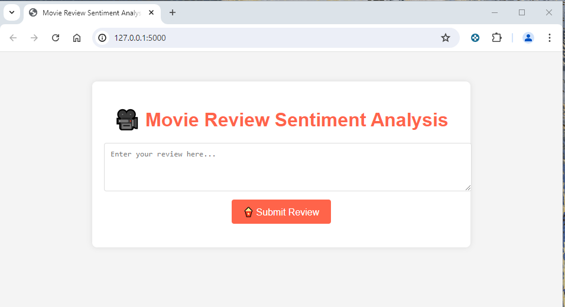
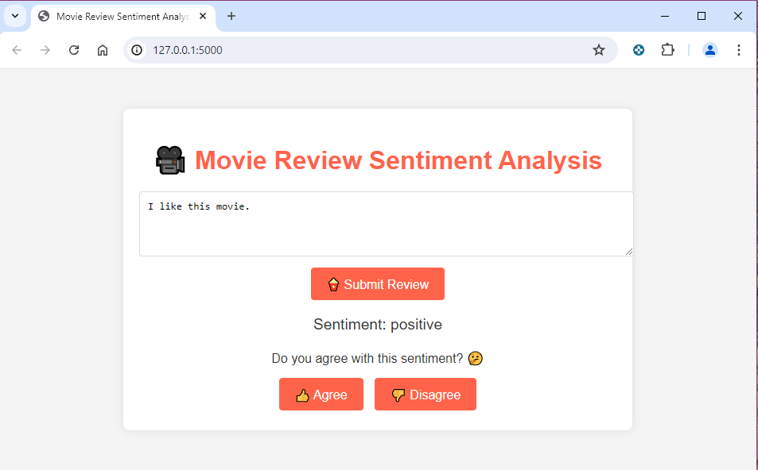
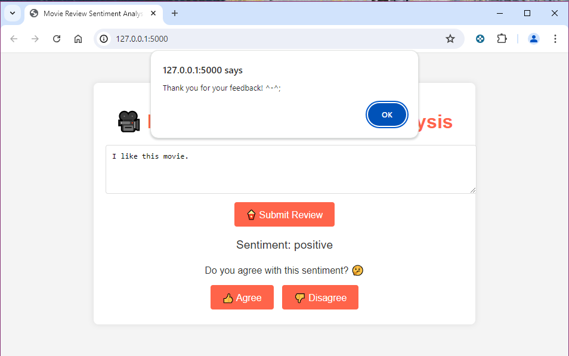

## Overview 

This project aims to perform sentiment analysis on the IMDB movie reviews dataset. It involves preprocessing text data, vectorizing the text using TF-IDF, training a machine learning model, and evaluating its performance.

Input any movie reviews and it will tell you whether it's a positive or negative review. 


If you disagree with the system-generated response, please click "Disgree" to let us know to help us improve its accuracy. 



## Getting Started 

Install the required packages using pip
```
pip install tensorflow scikit-learn nltk pandas numpy keras-tuner
```
### Requirements
- Python 3.7+
- TensorFlow
- Scikit-learn
- NLTK
- Pandas
- Numpy
- Keras Tuner

### Model deployment 
The model uses Flask framework to be deployed..

```
flask run
```

## Dataset

The dataset used in this project is [the IMDB Movie Reviews dataset](https://www.kaggle.com/datasets/lakshmi25npathi/imdb-dataset-of-50k-movie-reviews), which contains movie reviews along with their corresponding sentiment labels (positive or negative). The dataset has been augmented and cleaned for better performance.

## Model 

### Architecture  
The model used is a Sequential Keras model with the following layers:

- Dense layers with ReLU activation.
- Dropout layers to prevent overfitting.
- Output layer with sigmoid activation for binary classification.

### Evaluation 
The model was trained on the TF-IDF vectorized data. The training process included:

- Splitting the data into training and validation sets.
- Using binary cross-entropy as the loss function.
- Using accuracy as the metric for evaluation.

### Evaluation 
The model was evaluated on the validation set using the following metrics:

- Loss
- Accuracy
- Classification report (Precision, Recall, F1-Score)
- Confusion matrix