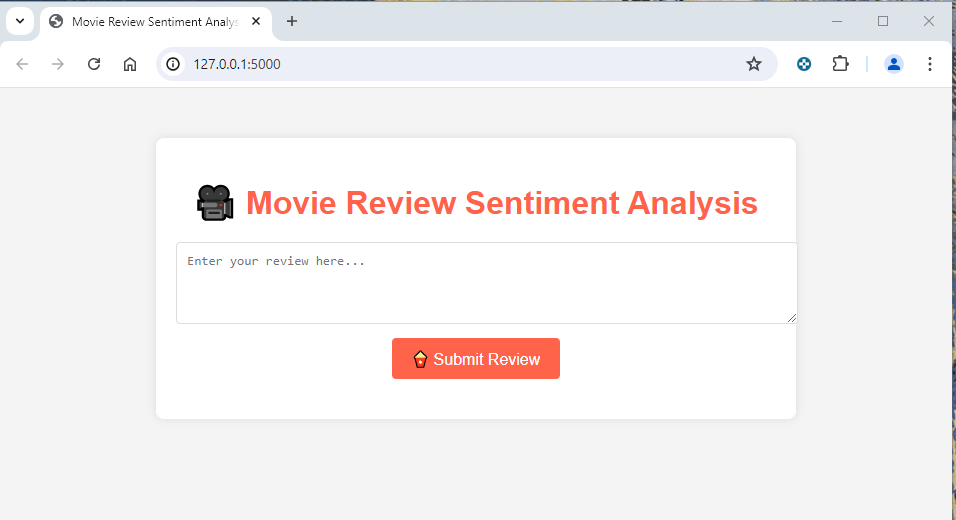

# Sentiment Analysis Flask App

This Flask application allows users to predict the sentiment of a given text review using a pre-trained sentiment analysis model. Users can also report incorrect predictions to improve the accuracy of model over time.

This project aims to perform sentiment prediction on the IMDB movie reviews dataset. It involves training and evaluating sentiment analysis models using different neural network architectures, such as LSTM and CNN. The models are trained on a preprocessed and augmented dataset of movie reviews and are evaluated based on their accuracy and performance metrics. The project includes hyperparameter tuning, model performance visualization, and saving the best model in both .h5 and TensorFlow Lite formats.



## Table of Contents

- [Features](#features)
- [Dataset](#dataset)
- [Requirements](#requirements)
- [Installation](#installation)
- [Notebook Sections](#notebook-sections)

## Features

- Predict sentiment of text reviews (positive/negative).
    - Enter a text review in the input field.
    - Click on "Submit Review" button to get the sentiment prediction.
    - Help in understanding user feedback and gauge overall user satisfaction.

- Report incorrect predictions to improve the accuracy of the model.
    - If the prediction is incorrect, click on the "Disagree" button.
    - The review will be saved into the excel file for future model retraining.
    - Allow for manual correction and data labeling.

- Monitor and retrain the model with new feedback.
    - Improve the robustness and reliability of predictions. 

## Dataset

The dataset used in this project is [IMDB Movie Reviews dataset](https://www.kaggle.com/datasets/lakshmi25npathi/imdb-dataset-of-50k-movie-reviews), which contains movie reviews along with their corresponding sentiment labels (positive or negative). The dataset has been augmented and cleaned for better performance.

## Requirements

- Python version: 3.11.7 |
- Jupyter Notebook
- TensorFlow version: 2.16.2
- Keras Tuner version: 1.4.7
- NLTK version: 3.8.1
- Pandas version: 2.2.2
- NumPy version: 1.26.4

## Installation

1. **Clone the repository:**

    ```sh
    git clone https://github.com/WWWW-W/Sentiment_Prediction.git
    cd sentiment_analysis_flask
    ```

2. **Create and activate a virtual environment:**

    ```sh
    python -m venv venv
    source venv/bin/activate  # On Windows use `venv\Scripts\activate`
    ```

3. **Install the required packages:**

    ```sh
    pip install -r requirements.txt
    ```

4. **Download and place the pre-trained model:**

    Download the pre-trained model `best_sentiment_analysis_model.h5` and place it in the `model/` directory.

5. **Run the Flask app:**

    ```sh
    python app.py
    ```

6. **Open the app in your browser:**

    Go to `http://127.0.0.1:5000` to use the app.

7. **Open the notebook:**

    Open `preprocess2.ipynb, project.ipynb, Tensorboard.ipynb` in Jupyter Notebook.

## Notebook Sections

 **Data Preprocessing - preprocess.ipynb:**
    - Load and clean the dataset.
    - Tokenize and pad the text data.
    - Exploratory data analysis 

**Model Training with TensorFlow - project.ipynb:**
    - Data preparation  
        - Automate data preprocessing, including data cleaning, normalization, and feature engineering.
        - Integrate data augmentation techniques to enhance the model's ability to generalize.
        - Splitting the data into training and validation sets.

    - Model 
        - Experiment with different model architectures such as feedforward neural networks, CNNs, and LSTMs.
        - Streamline the model training process using TensorFlow's high-level APIs like Keras.

    - Hyperparameter Tuning 
        - Explore various hyperparameter configurations and optimization techniques.
        - Use Keras Tuner to find the best hyperparameters.
        - Train the model with the best hyperparameters.

    - Model Evaluation  
        - Track and document experiments using TensorBoard.
        - The model was evaluated on the validation set using the following metrics:
            - Loss
            - Accuracy
            - Classification report (Precision, Recall, F1-Score)
            - Confusion matrix
    - Save the trained model. Convert the model the standard .h5 format for deploayment on web application. 

**Model Monitoring with TensorBoard - Tensorboard.ipynb:** 
    - Evaluate the trained model using appropriate metrics and validation techniques.

